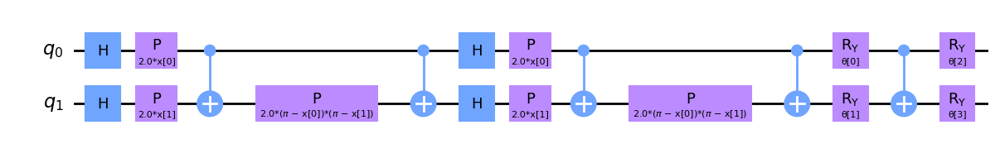
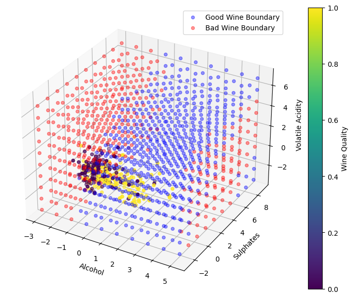

# IonQ Machine Learning Demo

## Description

This repository contains code for a hybrid quantum-classical machine learning classifier. The model is trained on the red wine quality dataset and utilizes both classical neural networks and quantum neural networks (QNNs) from Qiskit.

**Ansatz**:



**Decision Boundary:**



## Installation

Navigate to the project directory:

```bash
cd ionq-ml-demo
```

Create a virtual environment (optional):

```bash
python3 -m venv .venv
```

Activate the virtual environment:

```bash
source .venv/bin/activate  # On Unix or MacOS
.venv\Scripts\Activate     # On Windows
```

Install the required packages:

```bash
pip install -r requirements.txt
```

## Usage

1. Open the `main.ipynb` Jupyter Notebook:

   ```bash
   jupyter notebook main.ipynb
   ```

2. Run the cells in the notebook to train the model. The trained model will be saved as `model.pt`.

3. To use the model in your applications, you can load it using PyTorch's `torch.load()` method.
